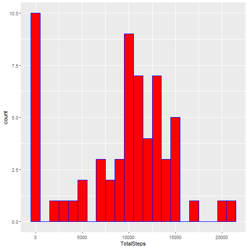
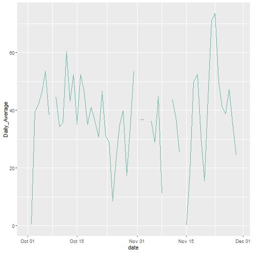
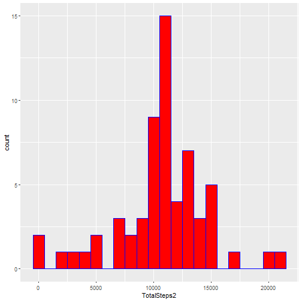
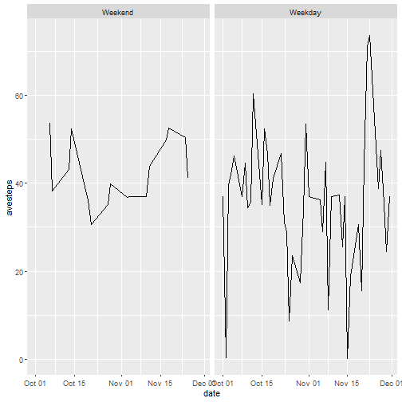

### Loading and Processing Data


```r
if(!dir.exists("RepData_PeerAssessment1")){
    dir.create("RepData_PeerAssessment1")
}

if(!str_ends(getwd(), "/RepData_PeerAssessment1")){
    setwd("/RepData_PeerAssessment1")
}

activity_data <- read.csv("activity.csv")
    activity_data$date <- as.Date(activity_data$date)
```

### Mean total number of steps taken per day


```r
steps_per_day <- activity_data %>% group_by(date) %>% summarise(TotalSteps = sum(steps,na.rm = T))

ggplot(steps_per_day) + geom_histogram(aes(TotalSteps), fill = "red", color = "blue", binwidth = 1000)
```



```r
mean_steps_per_day <- mean(steps_per_day$TotalSteps)

median_steps_per_day <- median(steps_per_day$TotalSteps)

print(paste("Mean of the total number of steps equals", as.integer(mean_steps_per_day)))
```

```
[1] "Mean of the total number of steps equals 9354"
```

```r
print(paste("Median of the total number of steps per day", as.integer(median_steps_per_day)))
```

```
[1] "Median of the total number of steps per day 10395"
```

### Average Daily Activity Pattern


```r
Average_Steps <- activity_data %>% group_by(date) %>% summarise(Daily_Average = mean(steps, na.rm = T))

ggplot(Average_Steps, aes(date, Daily_Average)) + geom_line(color = "#69b3a2")
```

```
Warning: Removed 2 row(s) containing missing values (geom_path).
```



```r
print(paste("Maximum number of steps in a 5-minute interval is", as.integer(max(Average_Steps$Daily_Average, na.rm = T))))
```

```
[1] "Maximum number of steps in a 5-minute interval is 73"
```

### Imputing missing values

There are 8 date observations that have NA as missing values. The steps variable for these dates are missing all through, these implies that there are no steps recorded for those dates. Therefore, there is nothing to be used for those dates (i.e either mean or median) to fill in the missing values. As a result of this, the mean of the average daily activity computed above will be used as the input for these missing values. 

```r
num_missing <- sum(is.na(activity_data$steps))
print(paste("Total number of missing data is", num_missing))
```

```
[1] "Total number of missing data is 2304"
```

```r
# Calculate the mean of the daily averages
overall_mean <- as.integer(mean(Average_Steps$Daily_Average, na.rm = T))
activity_data2 <- activity_data
activity_data2$steps[is.na(activity_data2$steps)] <- 37

steps_per_day2 <- activity_data2 %>% group_by(date) %>% summarise(TotalSteps2 = sum(steps,na.rm = T))

ggplot(steps_per_day2) + geom_histogram(aes(TotalSteps2), fill = "red", color = "blue", binwidth = 1000)
```



```r
mean_steps_per_day2 <- mean(steps_per_day2$TotalSteps2)

median_steps_per_day2 <- median(steps_per_day2$TotalSteps2)

print(paste("Mean of the total number of steps equals", mean_steps_per_day2))
```

```
[1] "Mean of the total number of steps equals 10751.737704918"
```

```r
print(paste("Median of the total number of steps per day", median_steps_per_day2))
```

```
[1] "Median of the total number of steps per day 10656"
```

These values can be seen to differ from the estimates of the first assignment but only in a little way.

### Differences in activity patterns between weekdays and weekends


```r
activity_data2 %>% mutate(Day_type = wday(date, label = T)) %>% mutate(Day_type = fct_collapse(Day_type, Weekday = c("Mon", "Tue", "Wed", "Thu", "Fri"), Weekend = c("Sat", "Sun"))) %>% group_by(Day_type,date) %>% summarize(avesteps = mean(steps)) %>% ggplot(aes(date, avesteps)) + geom_line() + facet_wrap(~ Day_type)
```

```
## `summarise()` has grouped output by 'Day_type'. You can override
## using the `.groups` argument.
```


